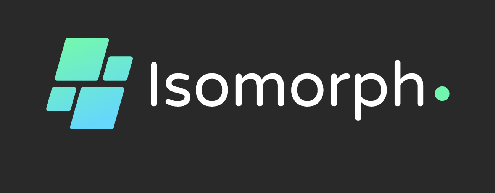

# Isomorph Staking Protocol



Isomorph Staking is a liquid staking protocol built on Fuel Network that enables users to stake ETH and receive liquid staking tokens (isoTokens) in return. These tokens represent your staked ETH and can be used across DeFi applications while your original stake continues to earn rewards.

## Overview

Isomorph Staking solves the liquidity problem in traditional staking by providing:
- Immediate liquidity through isoTokens
- 1:1 backing of all isoTokens with staked ETH
- Seamless integration with Fuel Network's ecosystem
- Transparent staking mechanism

## Prerequisites

- Rust (latest stable)
- Fuel toolchain
- Node.js (optional, for deployment scripts)

## Installation

1. Install Fuel toolchain:
```bash
curl -L https://install.fuel.network | sh
fuelup toolchain install latest
```

2. Clone the repository:
```bash
git clone <your-repo-url>
cd isomorph-staking
```

3. Build the project:
```bash
forc build
```

## Project Structure

```
isomorph-staking/
├── Forc.toml           # Project configuration
├── src/
│   └── main.sw         # Main staking contract
├── tests/
│   └── harness.rs      # Test suite
└── README.md           # This file
```

## Smart Contracts

### Isomorph Staking Contract (`src/main.sw`)

Core features:
- `stake()`: Stake ETH and receive isoTokens
- `unstake(amount)`: Return isoTokens and receive ETH back
- `get_staked_amount(user)`: View user's staked amount
- `get_total_staked()`: View total staked amount

### Testing

Run the test suite:
```bash
forc test
```

The test suite includes:
- Initial state verification
- Staking functionality
- Unstaking functionality
- Error cases
- IsoToken minting/burning verification

## Usage

1. Deploy the contract:
```bash
forc deploy --url <network-url>
```

2. Interact with the contract:
```bash
# Example stake transaction
forc run --url <network-url> stake --amount 1000

# Example unstake transaction
forc run --url <network-url> unstake --amount 500
```

## Local Development

1. Start a local Fuel node:
```bash
fuel-core run --db-type in-memory
```

2. Deploy to local network:
```bash
forc deploy --url http://localhost:4000/graphql
```

## Security Features

- 24-hour minimum staking period
- Secure isoToken minting/burning mechanism
- Balance validation for unstaking
- Basic reentrancy protection

## Roadmap

### Phase 1 (Current)
- [x] Basic staking functionality
- [x] IsoToken implementation
- [x] Testing framework

### Phase 2
- [ ] Advanced reward distribution
- [ ] Governance features
- [ ] Emergency pause functionality

### Phase 3
- [ ] Cross-chain integration
- [ ] Advanced analytics dashboard
- [ ] Yield optimization strategies

## Contributing

1. Fork the repository
2. Create your feature branch (`git checkout -b feature/amazing-feature`)
3. Commit changes (`git commit -m 'Add amazing feature'`)
4. Push to the branch (`git push origin feature/amazing-feature`)
5. Create a Pull Request

## Testing Guidelines

When adding new features:
1. Add corresponding test cases in `tests/harness.rs`
2. Ensure all existing tests pass
3. Add documentation for new functionality

## License

Apache License 2.0

## Support

For questions and support:
- Open an issue in the repository
- Join our community discussions [link to community]
- Technical documentation [link to docs]

## Team

[https://isomorph.wiki]

## Acknowledgments

- Fuel Network
- Sway Language Documentation
- The Fuel Developer Community

---

Built with ❤️ on Fuel Network
